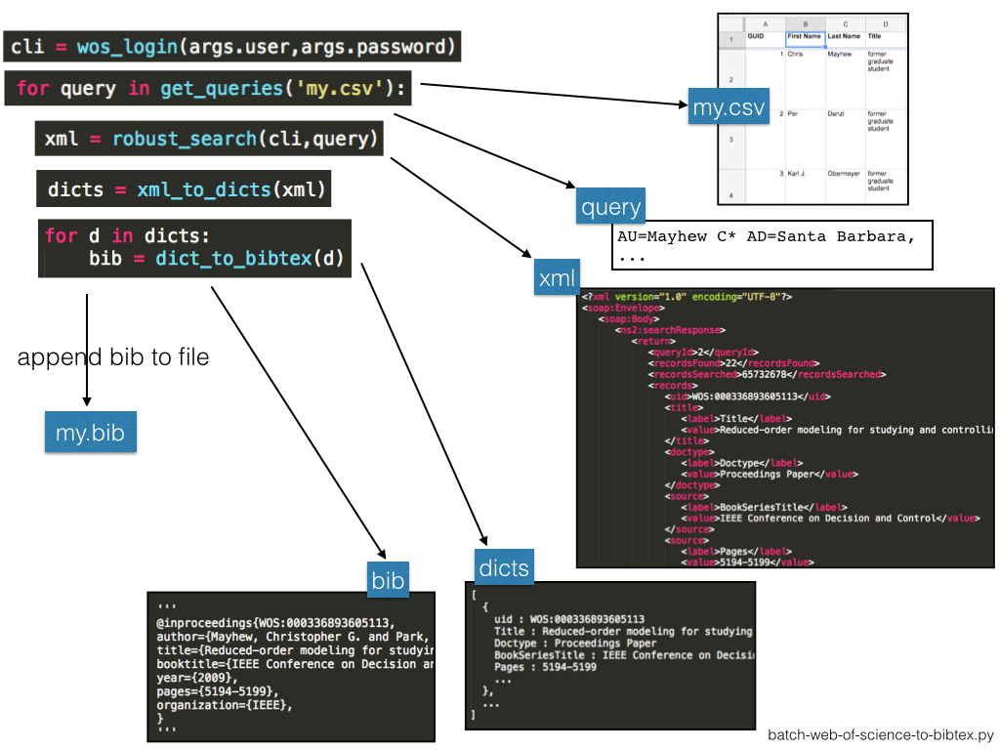

# Batch download bibliographies from "Web Of Science" and save as BibTeX

Table of Contents:

- [Summary](#summary)
- [How to use](#how-to-use)
- [Code architecture](#code-architecture)


## Summary


- Tested on Python 2.7.
- Requires the `wos-lite` branch of the `wos` package from enricobacis ([source](https://github.com/enricobacis/wos)):


            git clone https://github.com/enricobacis/wos.git
            git checkout wos-lite
            python setup.py install

    - NOTE: The version installed by `pip install wos` didn't work for me; I specifically needed the `wos-lite` branch.


- Requires a "Lite" or "Premium" subscription to the [Web of Science "Web Services"](http://ipscience-help.thomsonreuters.com/wosWebServicesLite/WebServicesLiteOverviewGroup/Introduction.html), currently owned by Clarivate Analytics.
    - This is not the same as signing up for a free account on webofknowledge.com. Rather, your school or work probably has to pay for API access. If you work at UC Santa Barbara, talk to Shari Laster (slaster@ucsb.edu).
    - I hard-coded the use of Lite.
- Input: CSV file with columns "First name" & "Last name"
- Output: `.bib` file of BibTeX entries for publications of the people listed in the CSV file
- Caches retrieved files to a [shelve](https://docs.python.org/2/library/shelve.html) database.
    - Doesn't retreive an author's publications if the cache has more than the Web of Science.
- Currently only conference papers & journal articles are exported to BibTeX. 
    - It's a pain to map between [all the WoS doctypes](http://ipscience-help.thomsonreuters.com/inCites2Live/indicatorsGroup/aboutHandbook/appendix/documentTypes.html) and [all the BibTeX entry types](http://bib-it.sourceforge.net/help/fieldsAndEntryTypes.php).

## How to use

The CSV file `people.csv` is provided:


Execute at terminal (Python 2.7):

    $ python batch-web-of-science-to-bibtex.py \
        --user=<your-WoS-username> \
        --password=<your-WoS-password> \
        --input='people.csv' \
        --output='out.bib' \
        --cache='wos.shelf'


Prints out:


    CSV line 1, Query: AU=Mayhew C* AND AD=Santa Barbara
    Have 0 biblios locally already in shelf file wos.shelf
    22 biblios available online.
    Request 1 of 1: Retrieving results 1 -- 22...
    Attempt # 1...
    cli.search success!
    Parsing 22 records...


    CSV line 2, Query: AU=Danzl P* AND AD=Santa Barbara
    Have 0 biblios locally already in shelf file wos.shelf
    8 biblios available online.
    Request 1 of 1: Retrieving results 1 -- 8...
    Attempt # 1...
    cli.search success!
    Parsing 8 records...


    CSV line 3, Query: AU=Obermeyer K* AND AD=Santa Barbara
    Have 0 biblios locally already in shelf file wos.shelf
    4 biblios available online.
    Request 1 of 1: Retrieving results 1 -- 4...
    Attempt # 1...
    cli.search success!
    Parsing 4 records...
    All done!


Produces bibtex file `out.bib`:

    @inproceedings{WOS:000336893605113,
    author={Mayhew, Christopher G. and Park, Sungbae and Ahmed, Jasim and Chaturvedi, Nalin A. and Kojic, Aleksandar and Knierim, Karl Lukas},
    title={Reduced-order modeling for studying and controlling misfire in four-stroke HCCI engines},
    booktitle={IEEE Conference on Decision and Control},
    year={2009},
    pages={5194-5199},
    organization={IEEE},
    }
    @inproceedings{WOS:000295049104123,
    author={Teel, Andrew R. and Mayhew, Christopher G.},
    title={Hybrid Control of Spherical Orientation},
    booktitle={IEEE Conference on Decision and Control},
    year={2010},
    pages={4198-4203},
    organization={IEEE},
    }
    ...


Caches the results to [shelve](https://docs.python.org/2/library/shelve.html) file `wos.shelf`:

```python

    import shelve
    db = shelve.open('wos.shelf')
    db.keys()

        ['AU=Danzl P* AND AD=Santa Barbara', 'AU=Mayhew C* AND AD=Santa Barbara', 'AU=Obermeyer K* AND AD=Santa Barbara']

    len(db['AU=Mayhew C* AND AD=Santa Barbara'])
        
        22

    import pprint
    pprint.pprint( db['AU=Mayhew C* AND AD=Santa Barbara'][0] )

        {u'Authors': u'Mayhew, Christopher G. and Park, Sungbae and Ahmed, Jasim and Chaturvedi, Nalin A. and Kojic, Aleksandar and Knierim, Karl Lukas',
         u'BookGroupAuthors': u'IEEE',
         u'BookSeriesTitle': u'IEEE Conference on Decision and Control',
         u'Doctype': u'Proceedings Paper',
         u'Identifier.Eisbn': u'978-1-4244-3872-3',
         u'Identifier.Ids': u'BA5OA',
         u'Identifier.Issn': u'0743-1546',
         u'Identifier.Xref_Doi': u'10.1109/CDC.2009.5400597',
         u'Pages': u'5194-5199',
         u'Published.BiblioYear': u'2009',
         u'ResearcherID.Disclaimer': u'ResearcherID data provided by Clarivate Analytics',
         u'SourceTitle': u'PROCEEDINGS OF THE 48TH IEEE CONFERENCE ON DECISION AND CONTROL, 2009 HELD JOINTLY WITH THE 2009 28TH CHINESE CONTROL CONFERENCE (CDC/CCC 2009)',
         u'Title': u'Reduced-order modeling for studying and controlling misfire in four-stroke HCCI engines',
         'uid': u'WOS:000336893605113'}
```

## Code architecture



1. `wos_login()` logs in to WoS. 

2. `get_queries()` reads the CSV file `people.csv` and returns a sequence of query strings. 

3. For each query, `robust_search()` searches the Web of Science for it.

    - If the WoS SOAP server returns an error, `robust_search()` waits 1 second then tries again.
    - The flag `raw=True` requests an XML response instead of a `suds.sudsobject.searchResults` object (simpler to parse). 

4. `xml_to_dicts()` takes this XML and uses [BeautifulSoup](https://www.crummy.com/software/BeautifulSoup/) to parse the XML into a list of dictionaries, each one storing a bibliography of some conference paper or journal article.

5. For each dictionary, `dict_to_bibtex()` converts it to a BibTeX entry and writes it to `out.bib`. 

6. The dicts are also written to the shelf file `wos.shelf` for caching.
    - The shelf file is a dictionary: keys are queries, and values are lists of dictionaries (bibliographies) returned by WoS for that query.
    - A query is only sent to WoS if WoS has more results than exist in the shelf file for that query.
